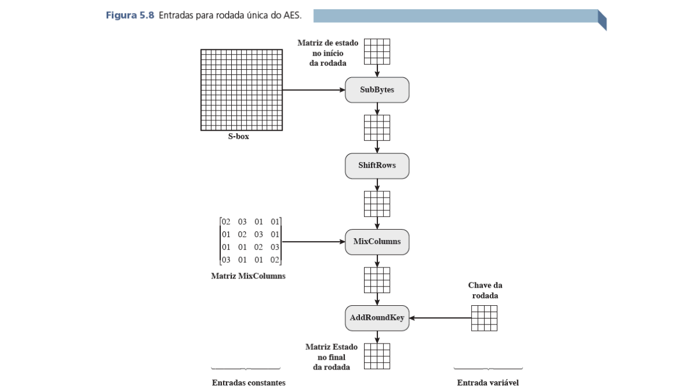

# Criptografia AES em Python
> **Disciplina:** Cybersecurity

Este repositório contém uma implementação do algoritmo de criptografia AES em Python. A criptografia AES (Advanced Encryption Standard) é um método utilizado para garantir a segurança e a privacidade dos dados.

## Objetivo do Projeto
Desenvolver uma aplicação em Python capaz de criptografar e descriptografar mensagens utilizando o algoritmo AES. Este projeto foi desenvolvido para a disciplina de Cybersecurity, implementação de algoritmos de criptografia simétrica.

## Resultados Esperados
Para um conjunto específico de dados de entrada, o resultado esperado da criptografia é:
- **Resultado esperado:** `FF0B844A0853BF7C6934AB4364148FB9`

##  Estrutura do Algoritmo AES
Abaixo está uma visualização da estrutura do algoritmo AES, mostrando o fluxo de criptografia e os passos envolvidos:



## Como Funciona a Criptografia AES?
AES (Advanced Encryption Standard) é um padrão de criptografia de bloco que utiliza chaves simétricas para encriptar e desencriptar dados. Neste projeto, usamos uma chave de 128 bits (ou 16 bytes), com os seguintes passos básicos:
1. **Expansão da Chave:** A chave é expandida para gerar múltiplas rodadas de chaves.
2. **Substituição (SubBytes):** Cada byte é substituído por outro byte de acordo com uma tabela de substituição (S-Box).
3. **Deslocamento (ShiftRows):** As linhas são deslocadas ciclicamente.
4. **Mistura (MixColumns):** Os dados são misturados para dificultar a análise criptográfica.
5. **Adição de Chave de Rodada (AddRoundKey):** A chave é adicionada aos dados com uma operação XOR.

> **Nota:** O algoritmo é repetido por 10 rodadas para criptografia e descriptografia completa.

## Como Rodar?
### Pré-requisitos
Para rodar o projeto, você precisará de:
- Python 3.x (nenhuma biblioteca externa adicional é necessária)

### Execução
Abra o PowerShell e execute os seguintes comandos:

```
python aes.py
```
